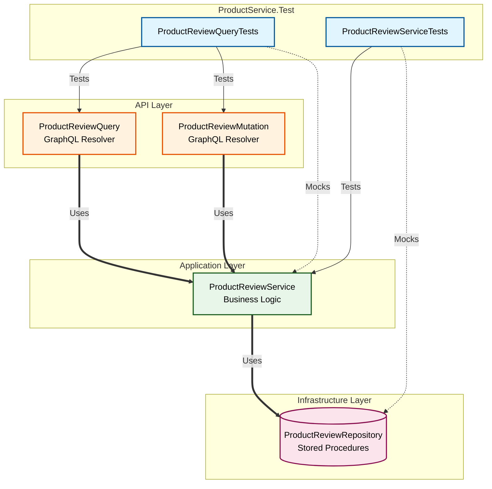

# 🧪 ProductService.Test

<p align="center">
  
  
  
  
</p>

This project contains the automated unit test suite for the **ProductService** microservice. It ensures the reliability, correctness, and stability of both the core product review business logic and the GraphQL API layer.

---

## 🏗️ Architecture & Isolation Strategy

To ensure our unit tests are lightning-fast and extremely reliable, we use strict isolation. We test one layer at a time, mocking the dependencies immediately below it so we do not rely on live databases, stored procedures, or network systems.



---

## 📂 Project Structure & Test Coverage

We employ a single test project structured into folders that precisely mirror the service layers.

### 1. Application Layer (`ProductReviewServiceTests.cs`)
Validates core business rules, input validations, DTO mapping, and data structure conversions.

| Test Case Name | Scenario Tested | Expected Outcome |
| :--- | :--- | :--- |
| `GetProductReviewByIdAsync_ReturnsMappedDtos_WhenReviewsExist` | Valid reviews found in database | Returns fully mapped list of `ProductReviewDto` |
| `GetProductReviewByIdAsync_ReturnsEmpty_WhenNoReviewsFound` | Product has no reviews | Returns empty list |
| `AddProductReviewAsync_ReturnsZero_WhenInputIsNull` | Input is `null` | Returns `0` immediately without calling repository |
| `AddProductReviewAsync_MapsInputAndReturnsReviewId_WhenInputIsValid` | Valid product review input | Mappings succeed and returns generated review ID |
| `TakeUserVotingAsync_ReturnsMappedDto_WhenVotingSucceeds` | Valid vote registration | Returns updated `ReviewHelpFulDto` with updated vote count |
| `TakeUserVotingAsync_ReturnsNull_WhenVotingReturnsNull` | Database vote registration fails | Returns `null` |
| `GetProductReviewDetailAsync_ReturnsMappedDtos_WhenReviewsExist` | Valid detailed reviews request | Returns filtered, mapped product review DTOs |
| `GetUserProfileReviewsAsync_ReturnsMappedDtos_WhenReviewsExist` | User profile reviews request | Returns mapped list of user-submitted review DTOs |
| `GetReviewReaderTypeAsync_ReturnsMappedDtos` | Product reader types request | Returns reader types successfully mapped to DTOs |
| `GetAllReviewReaderTypeAsync_ReturnsMappedDtos` | All reader types request | Returns list of reader types |
| `GetReviewTagsNameAsync_ReturnsMappedDtos` | Available review tags request | Returns list of tags |
| `GetProductRatingCountAsync_ReturnsMappedDtos` | Rating counts request | Returns star rating distribution |
| `GetProductReviewByIdAsync_FiltersOutNullEntities_WhenNullReturnedFromRepository` | Repository returns list containing a null element | Maps null item to null, which is filtered out, yielding clean list |
| `GetProductReviewByIdAsync_HandlesNullNavigationProperties_Correctly` | Review has null images and helpful entities | Maps to empty images list and zeroed default helpful DTO |

### 2. API Layer (`ProductReviewQueryTests.cs`)
Validates the GraphQL entry points, query/mutation parameters delegation, and controlled error handling formatting.

| Test Case Name | Scenario Tested | Expected Outcome |
| :--- | :--- | :--- |
| `GetProductReviewById_CallsServiceAndReturnsList` | Resolver called for reviews | Delegates to application service and returns response list |
| `GetProductRatingCount_CallsServiceAndReturnsList` | Resolver called for rating counts | Delegates to service and returns list |
| `PostReview_ThrowsGraphQLException_WhenTitleIsEmpty` | Review input has empty title | Throws controlled `GraphQLException` ("ReviewTitle is required") |
| `PostReview_CallsServiceAndReturnsId_WhenInputIsValid` | Valid review submitted via mutation | Calls service and returns generated ID |
| `TakeUserVoting_CallsServiceAndReturnsResult` | User votes on review via resolver | Delegates to service and returns update result |
| `GetProductReviewDetail_DelegatesToService` | Resolver called for detailed reviews | Delegates to service and returns DTO list |
| `GetUserProfileReviews_DelegatesToService` | Resolver called for user profile reviews | Delegates to service and returns DTO list |
| `GetReviewReaderType_DelegatesToService` | Resolver called for product reader types | Delegates to service and returns DTO list |
| `GetAllReviewReaderType_DelegatesToService` | Resolver called for all reader types | Delegates to service and returns DTO list |
| `GetReviewTagsName_DelegatesToService` | Resolver called for tags lookup | Delegates to service and returns DTO list |

---

## 🚀 Execution Guide

### Visual Studio
The easiest way to run the test suite is visually:
1. Press `Ctrl + E, T` to open the **Test Explorer**.
2. Click the green ▶️ **Run All** button in the top left.

### .NET CLI
For CI/CD pipelines or rapid terminal usage, run this from the repository root:

```bash
dotnet test ProductService/ProductService.Test/ProductService.Test.csproj --verbosity normal
```
