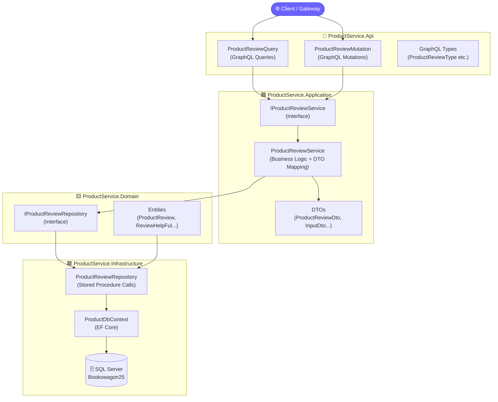
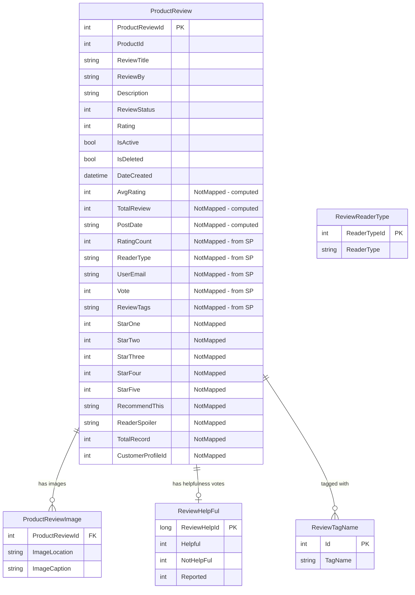
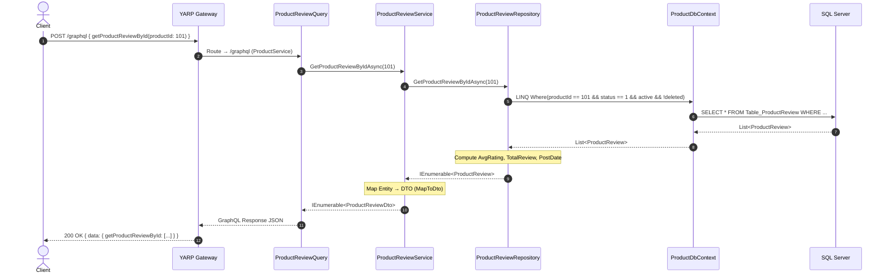
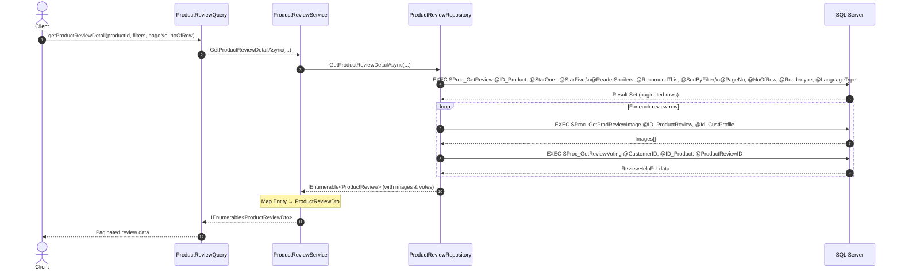
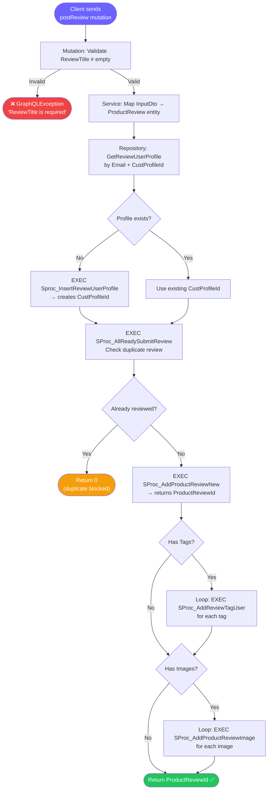
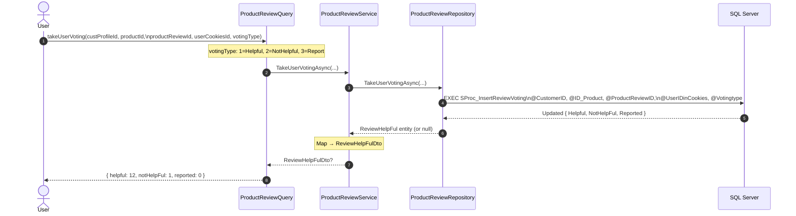
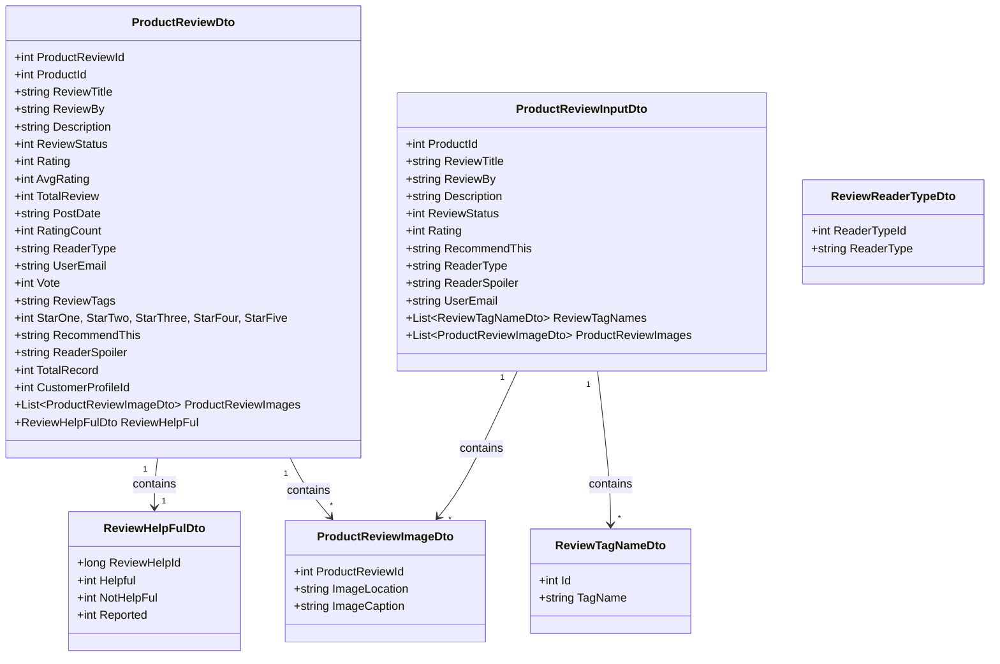
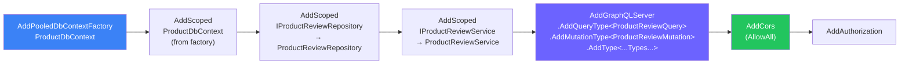

# 📦 ProductService — Bookswagon Microservice

> A **Clean Architecture** microservice responsible for all **Product Review** operations within the Bookswagon e-commerce platform. Exposes a **GraphQL API** (HotChocolate) backed by **SQL Server** stored procedures.

---

## 📋 Table of Contents

1. [Overview](#overview)
2. [Architecture](#architecture)
3. [Project Structure](#project-structure)
4. [Domain Model](#domain-model)
5. [GraphQL API Reference](#graphql-api-reference)
6. [Request Flow Diagrams](#request-flow-diagrams)
7. [Stored Procedure Mapping](#stored-procedure-mapping)
8. [Data Transfer Objects (DTOs)](#data-transfer-objects-dtos)
9. [Dependency Injection & Startup](#dependency-injection--startup)
10. [Configuration](#configuration)
11. [Running Locally](#running-locally)

---

## Overview

**ProductService** is a dedicated microservice in the Bookswagon API ecosystem. Its sole responsibility is managing **product reviews** — from browsing and filtering to submitting and voting.

| Attribute        | Value                                  |
|------------------|----------------------------------------|
| **Framework**    | .NET 10 (ASP.NET Core)                 |
| **API Protocol** | GraphQL via HotChocolate               |
| **Database**     | SQL Server (`Bookswagon25` schema)     |
| **Data Access**  | EF Core + Raw Stored Procedures        |
| **Architecture** | Clean Architecture (4-layer)           |
| **Gateway**      | YARP Reverse Proxy (`/graphql` route)  |

---

## Architecture

The service follows strict **Clean Architecture** principles — outer layers depend on inner layers, never the reverse.



### Dependency Rule

```
API  →  Application  →  Domain  ←  Infrastructure
```

- **Domain** has zero external dependencies (pure C# classes).
- **Application** depends only on Domain interfaces.
- **Infrastructure** implements Domain interfaces (Repository pattern).
- **API** (GraphQL resolvers) depends only on Application interfaces.

---

## Project Structure

```
ProductService/
│
├── ProductService.Api/                        # 🔷 Presentation Layer
│   ├── Program.cs                             # DI registration & middleware pipeline
│   ├── appsettings.json                       # Connection strings & config
│   └── GraphQL/
│       ├── Queries/
│       │   └── ProductReviewQuery.cs          # All GraphQL query resolvers
│       ├── Mutations/
│       │   └── ProductReviewMutation.cs       # GraphQL mutation resolvers
│       └── Types/
│           ├── ProductReviewType.cs           # HotChocolate ObjectType definitions
│           ├── ProductReviewImageType.cs
│           ├── ReviewHelpFulType.cs
│           ├── ReviewReaderTypeType.cs
│           └── ReviewTagNameType.cs
│
├── ProductService.Application/                # 🟩 Business Logic Layer
│   ├── DTOs/
│   │   ├── ProductReviewDto.cs                # Read DTO (rich output)
│   │   ├── ProductReviewInputDto.cs           # Write DTO (mutation input)
│   │   ├── ProductReviewImageDto.cs
│   │   ├── ReviewHelpFulDto.cs
│   │   ├── ReviewReaderTypeDto.cs
│   │   └── ReviewTagNameDto.cs
│   ├── Interfaces/
│   │   └── IProductReviewService.cs           # Service contract
│   └── Services/
│       └── ProductReviewService.cs            # Business logic + Entity→DTO mapping
│
├── ProductService.Domain/                     # 🟨 Core Domain Layer
│   ├── Entities/
│   │   ├── ProductReview.cs                   # Root aggregate
│   │   ├── ProductReviewImage.cs
│   │   ├── ReviewHelpFul.cs
│   │   ├── ReviewReaderType.cs
│   │   └── ReviewTagName.cs
│   └── Interfaces/
│       └── IProductReviewRepository.cs        # Repository contract
│
└── ProductService.Infrastructure/             # 🟥 Data Access Layer
    └── Data/
        ├── ProductDbContext.cs                # EF Core DbContext (Pooled)
        └── Repositories/
            └── ProductReviewRepository.cs     # All SP-based data access
```

---

## Domain Model

### Entity Relationship Diagram



> **Note:** Fields marked `[NotMapped]` are populated from stored procedure result sets and do not map to the `Table_ProductReview` database table columns directly. They represent computed or joined data returned by the SPs.

---

## GraphQL API Reference

The service exposes a single GraphQL endpoint at **`/graphql`**.

### Queries

| Query | Parameters | Returns | Description |
|---|---|---|---|
| `getProductReviewById` | `productId: Int!` | `[ProductReviewDto]` | Basic review list with avg rating & post date |
| `getProductRatingCount` | `productId: Int!` | `[ProductReviewDto]` | Star distribution counts (1★–5★) |
| `getProductReviewDetail` | `productId, starOne..starFive, readerSpoiler, recomendThis, sortByFilter, pageNo, noOfRow, readerType, languageType` | `[ProductReviewDto]` | Fully paginated & filtered reviews |
| `getUserProfileReviews` | `customerProfileId: Int!, pageNo: Int!, noOfRow: Int!` | `[ProductReviewDto]` | All reviews by a specific user |
| `getReviewReaderType` | `productId: Int!` | `[ReviewReaderTypeDto]` | Reader types used for a product |
| `getAllReviewReaderType` | *(none)* | `[ReviewReaderTypeDto]` | All reader type lookup values |
| `getReviewTagsName` | *(none)* | `[ReviewTagNameDto]` | All review tag name lookup values |
| `takeUserVoting` | `custProfileId, productId, productReviewId, userCookiesId, votingType` | `ReviewHelpFulDto` | Submit a helpful/not-helpful/report vote |

### Mutations

| Mutation | Input | Returns | Description |
|---|---|---|---|
| `postReview` | `ProductReviewInputDto` | `Int` | Adds a new review with images and tags |

### GraphQL Schema Snippet

```graphql
type Query {
  getProductReviewById(productId: Int!): [ProductReviewDto!]
  getProductRatingCount(productId: Int!): [ProductReviewDto!]
  getProductReviewDetail(
    productId: Int!, starOne: Int!, starTwo: Int!, starThree: Int!,
    starFour: Int!, starFive: Int!, readerSpoiler: Int!, recomendThis: Int!,
    sortByFilter: Int!, pageNo: Int!, noOfRow: Int!,
    readerType: String!, languageType: String!
  ): [ProductReviewDto!]
  getUserProfileReviews(customerProfileId: Int!, pageNo: Int!, noOfRow: Int!): [ProductReviewDto!]
  getReviewReaderType(productId: Int!): [ReviewReaderTypeDto!]
  getAllReviewReaderType: [ReviewReaderTypeDto!]
  getReviewTagsName: [ReviewTagNameDto!]
  takeUserVoting(
    custProfileId: Int!, productId: Int!, productReviewId: Int!,
    userCookiesId: String!, votingType: Int!
  ): ReviewHelpFulDto
}

type Mutation {
  postReview(input: ProductReviewInputDto!): Int!
}
```

---

## Request Flow Diagrams

### 1. Fetch Product Reviews (`getProductReviewById`)



---

### 2. Fetch Paginated & Filtered Reviews (`getProductReviewDetail`)



---

### 3. Submit a Review (`postReview` Mutation)



---

### 4. Submit a Vote (`takeUserVoting`)



---

## Stored Procedure Mapping

All heavy data operations are delegated to SQL Server stored procedures for performance and legacy compatibility.

| Repository Method | Stored Procedure | Access Method | Description |
|---|---|---|---|
| `GetProductReviewByIdAsync` | *(LINQ EF Core)* | EF Core LINQ | Direct table query with filters |
| `GetProductRatingCountAsync` | `SProc_GetProductRateingCount` | EF Core Raw SQL | Per-star rating counts |
| `GetProductReviewDetailAsync` | `SProc_GetReview` | EF Core Raw SQL | Full filtered + paginated reviews |
| `GetUserProfileReviewsAsync` | `SProc_GetUserReview` | EF Core Raw SQL | Reviews by customer profile |
| `GetReviewReaderTypeAsync` | `SProc_GetReviewReaderType` | EF Core Raw SQL | Reader types for a product |
| `GetAllReviewReaderTypeAsync` | `SP_GetReviewReaderType` | EF Core Raw SQL | All reader type lookup values |
| `GetReviewTagsNameAsync` | `SP_GetReviewTagName` | EF Core Raw SQL | All review tag names |
| `TakeUserVotingAsync` | `SProc_InsertReviewVoting` | EF Core Raw SQL | Record a user vote |
| `GetProductReviewImagesAsync` *(private)* | `SProc_GetProdReviewImage` | EF Core Raw SQL | Images for a review |
| `GetUserVotingAsync` *(private)* | `SProc_GetReviewVoting` | EF Core Raw SQL | Existing vote state |
| `AddProductReviewAsync` | `SProc_AddProductReviewNew` | EF Core Raw SQL | Insert new review |
| `GetReviewUserProfileAsync` *(private)* | `Sproc_GetReviewUserProfile` | EF Core Raw SQL | Look up reviewer profile |
| `AddReviewUserProfileAsync` *(private)* | `Sproc_InsertReviewUserProfile` | EF Core Raw SQL | Create reviewer profile |
| `CheckForUserProductReviewAsync` *(private)* | `SProc_AllReadySubmitReview` | EF Core Raw SQL | Duplicate review check |
| `AddReviewTagUserAsync` *(private)* | `SProc_AddReviewTagUser` | EF Core Raw SQL | Attach tag to review |
| `AddReviewImageAsync` *(private)* | `SProc_AddProductReviewImage` | EF Core Raw SQL | Attach image to review |

> **MARS Enabled:** The connection string uses `MultipleActiveResultSets=true`, which allows the repository to open nested connections for per-review image and vote sub-queries within a single loop.

---

## Data Transfer Objects (DTOs)

### DTO Hierarchy



---

## Dependency Injection & Startup

`Program.cs` wires up all services in the following order:



**Why `AddPooledDbContextFactory`?**

HotChocolate resolvers are executed concurrently per field. A pooled `IDbContextFactory<T>` is the recommended pattern to safely share and recycle `DbContext` instances without thread-safety issues, while also allowing classic scoped injection for repositories.

### Middleware Pipeline

```
Request
  │
  ├── UseHttpsRedirection
  ├── UseCors                   (AllowAnyOrigin, AnyHeader, AnyMethod)
  ├── UseAuthorization
  └── MapGraphQL("/graphql")    ← All GraphQL traffic handled here
```

---

## Configuration

### `appsettings.json`

```json
{
  "ConnectionStrings": {
    "ProductSchemaDB": "Data Source=<host>;Initial Catalog=Bookswagon25;
                        User ID=sa;Password=***;
                        MultipleActiveResultSets=true;
                        Encrypt=true;TrustServerCertificate=true"
  },
  "Logging": {
    "LogLevel": {
      "Default": "Information",
      "Microsoft.AspNetCore": "Warning"
    }
  }
}
```

> **Security Note:** Production deployments should store connection strings in environment variables or Azure Key Vault — never in committed `appsettings.json` files.

### YARP Gateway Routing (Gateway.Yarp)

The YARP gateway proxies `/product-service/graphql` → `http://localhost:<ProductServicePort>/graphql`.

---

## Running Locally

### Prerequisites

- .NET 10 SDK
- SQL Server (or accessible remote instance)
- Access to `Bookswagon25` database with all stored procedures

### Steps

```bash
# 1. Navigate to the API project
cd ProductService/ProductService.Api

# 2. Restore dependencies
dotnet restore

# 3. Run the service
dotnet run

# The service starts on https://localhost:7xxx / http://localhost:5xxx
# GraphQL Playground: https://localhost:<port>/graphql
```

### Sample GraphQL Query

```graphql
# Get all reviews for product 12345
query {
  getProductReviewById(productId: 12345) {
    productReviewId
    reviewTitle
    reviewBy
    rating
    avgRating
    totalReview
    postDate
    description
    reviewHelpFul {
      helpful
      notHelpFul
      reported
    }
    productReviewImages {
      imageLocation
      imageCaption
    }
  }
}
```

### Sample Mutation

```graphql
# Submit a new review
mutation {
  postReview(input: {
    productId: 12345
    reviewTitle: "Excellent Book!"
    reviewBy: "John Doe"
    description: "A must-read for every developer."
    rating: 5
    reviewStatus: 1
    recommendThis: "Yes"
    readerType: "1"
    readerSpoiler: "No"
    userEmail: "john@example.com"
    reviewTagNames: [{ id: 3, tagName: "Inspirational" }]
    productReviewImages: []
  })
}
```

---

## Key Design Decisions

| Decision | Rationale |
|---|---|
| **Stored Procedures for complex queries** | Legacy SP compatibility; SPs handle complex pagination & filtering at DB level |
| **LINQ for simple reads** | `GetProductReviewById` uses EF LINQ for readable, maintainable filtering |
| **`[NotMapped]` fields on entity** | SP result columns don't have table counterparts; annotated to prevent EF migration issues |
| **Pooled DbContextFactory** | Required for HotChocolate concurrent resolver execution |
| **DTOs at Application boundary** | Prevents domain entity leakage into the API; keeps GraphQL types decoupled from DB schema |
| **`MapToDto` private helper** | Centralizes all entity→DTO mapping logic in one place within the service |
| **Duplicate review check** | `SProc_AllReadySubmitReview` prevents a customer from reviewing the same product twice |

---

*Part of the **Bookswagon Microservice Platform** — built with Clean Architecture & GraphQL standards.*
