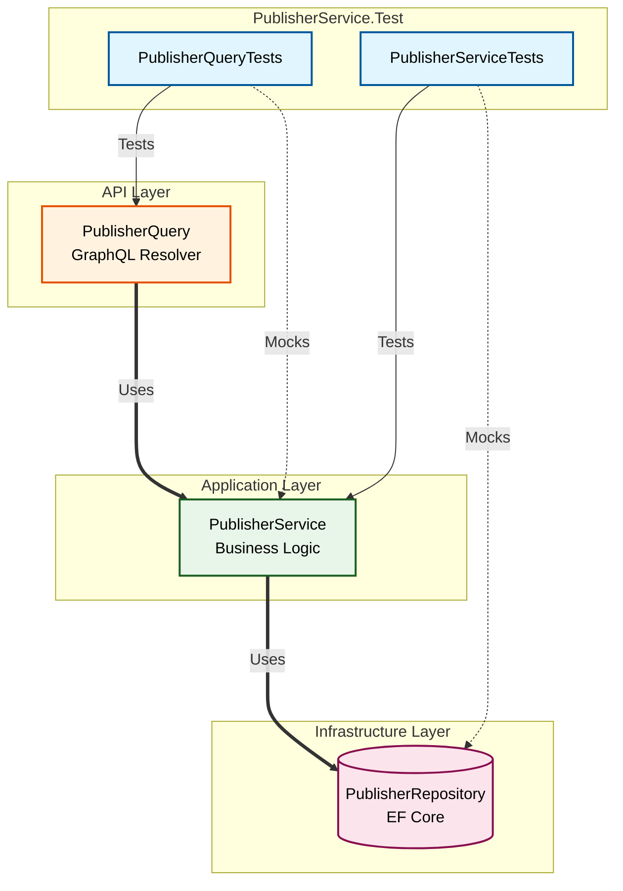

# 🧪 PublisherService.Test

<p align="center">
  
  
  
  
</p>

This project contains the automated unit test suite for the **PublisherService** microservice. It ensures the reliability, correctness, and stability of both the core business logic and the GraphQL API layer.

---

## 🏗️ Architecture & Isolation Strategy

To ensure our unit tests are fast and reliable, we use strict isolation. We test one layer at a time, mocking the dependencies immediately below it so we do not rely on live databases or external systems.



---

## 📂 Project Structure & Test Coverage

We employ a single test project structured into folders that precisely mirror the service layers. 

### 1. Application Layer (`PublisherServiceTests.cs`)
Validates core business rules, input validation, and Entity-to-DTO mapping.

| Test Case Name | Scenario Tested | Expected Outcome |
| :--- | :--- | :--- |
| `GetPublisherByIdAsync_WithValidId` | Valid positive ID | Returns mapped `PublisherDto` |
| `GetPublisherByIdAsync_WithInvalidId` | ID is `<= 0` | Returns `null` immediately (no DB call) |
| `GetPublisherByIdAsync_WhenPublisherNotFound` | ID does not exist in DB | Returns `null` |
| `GetPublishersByNameAsync_WithEmptyName` | Search string is empty | Returns empty list (no DB call) |
| `GetPublishersByNameAsync_WithValidName` | Valid search string | Returns mapped list of DTOs |

### 2. API Layer (`PublisherQueryTests.cs`)
Validates the GraphQL entry points, request delegation, and expected error handling formatting.

| Test Case Name | Scenario Tested | Expected Outcome |
| :--- | :--- | :--- |
| `GetPublisherByIdAsync_WhenPublisherExists` | Resolver finds publisher | Returns `PublisherDto` |
| `GetPublisherByIdAsync_WhenPublisherDoesNotExist` | Resolver cannot find publisher | Throws controlled `GraphQLException` |
| `GetPublishersByName_CallsServiceAndReturnsList` | Resolver performs search | Returns list without modification |

---

## 🚀 Execution Guide

### Visual Studio
The easiest way to run the test suite is visually:
1. Press `Ctrl + E, T` to open the **Test Explorer**.
2. Click the green ▶️ **Run All** button in the top left.

### .NET CLI
For CI/CD pipelines or rapid terminal usage, run this from the repository root:

```bash
dotnet test PublisherService/PublisherService.Test/PublisherService.Test.csproj --verbosity normal
```
