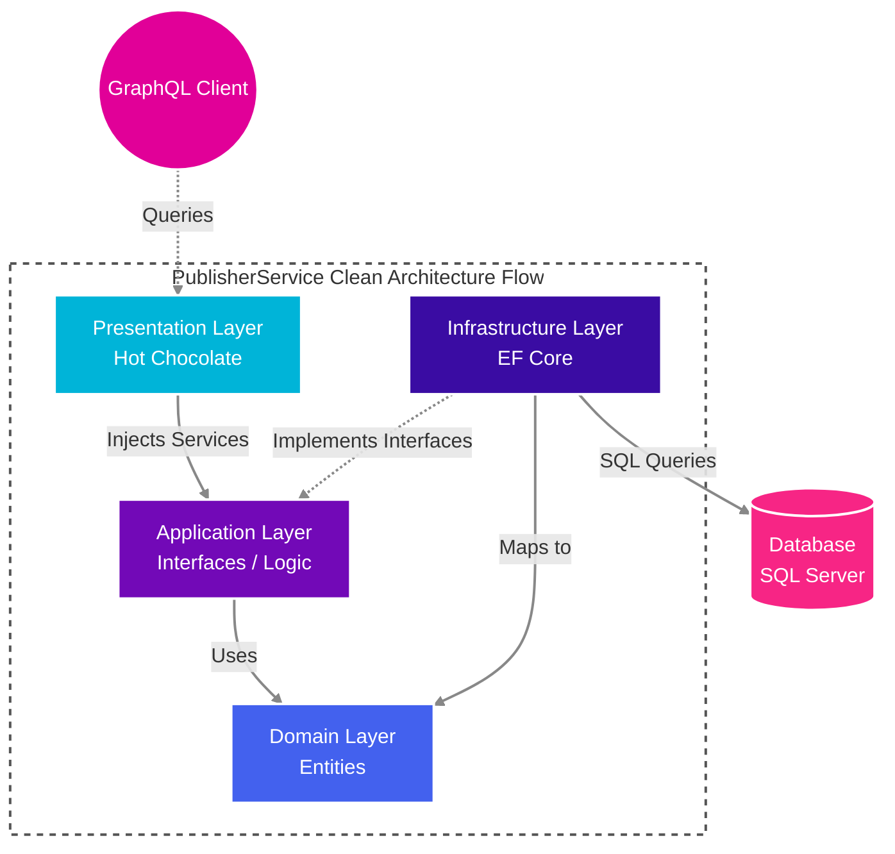
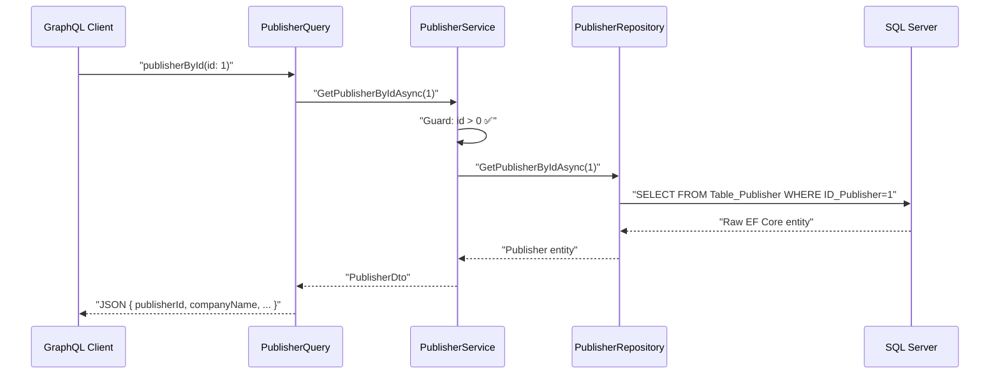
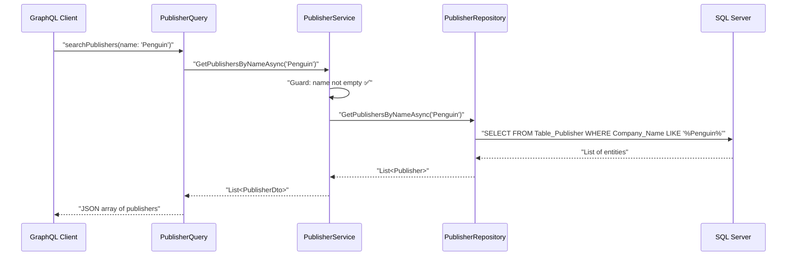

# ⭐ PublisherService

> A modern, high-performance **GraphQL API microservice** for Publisher data management.

This project is part of the **Bookswagon Core Architecture**, designed to deliver fast, scalable, and efficient publisher data using state-of-the-art .NET technologies. It serves primary use cases related to publisher profiles, search, and metadata retrieval.

---

## 📂 Project Structure

```
PublisherService/
│
├── PublisherService.Api/               ← Application entry point & DI registration
│   ├── GraphQL/
│   │   ├── Filters/
│   │   │   └── GraphQLErrorFilter.cs   ← Custom error handling for GraphQL
│   │   ├── Queries/
│   │   │   └── PublisherQuery.cs       ← GraphQL resolver: publisherById, searchPublishers
│   │   └── Types/
│   │       └── PublisherType.cs        ← Hot Chocolate type configuration
│   ├── Program.cs                      ← Middleware & Service configuration
│   └── appsettings.json                ← Configuration file
│
├── PublisherService.Application/       🟪 APPLICATION LAYER
│   ├── DTO/
│   │   └── PublisherDto.cs             ← Data Transfer Object for Publisher
│   ├── Interfaces/
│   │   ├── IPublisherService.cs        ← Service contract
│   │   └── IPublisherRepository.cs     ← Repository contract (Domain/Interfaces if strict, but placed here or Domain)
│   └── Services/
│       └── PublisherService.cs         ← Business logic + validation
│
├── PublisherService.Domain/            🟦 DOMAIN LAYER (Innermost)
│   ├── Entities/
│   │   └── Publisher.cs                ← EF Core entity mapped to legacy table
│   └── Interfaces/
│       └── IPublisherRepository.cs     ← Repository interface (as per investigation)
│
└── PublisherService.Infrastructure/    🟫 INFRASTRUCTURE LAYER
    ├── Data/
    │   ├── ApplicationDbContext.cs     ← EF Core DbContext
    │   └── Repositories/
    │       └── PublisherRepository.cs   ← EF Core Repository implementation
```
*(Note: Based on file structure analysis, `IPublisherRepository` is in `PublisherService.Domain.Interfaces` or `Application.Interfaces`. The implementation is in Infrastructure).*

---

## 🏗️ Architecture & Layers

Built solidly on **Clean Architecture** principles to ensure strict separation of concerns, the project is organized into concentric layers where dependencies always point inward.



### Layer-by-Layer Breakdown

#### 🟦 Domain Layer — `PublisherService.Domain`
The absolute core of the application. Contains **zero dependencies** on any other project layer.

| File | Purpose |
|------|---------|
| `Publisher.cs` | EF Core entity mapped to the legacy `Table_Publisher` SQL table via `[Table]` and `[Column]` attributes. |

**Key Column Mappings:**
| C# Property | DB Column | Notes |
|---|---|---|
| `PublisherId` | `ID_Publisher` | Primary Key |
| `CompanyName` | `Company_Name` | Nullable string |
| `PublisherImage`| `PublisherImage`| |
| `Description` | `Description` | |
| `PageTitle` | `PageTitle` | |
| `MetaDescription`| `MetaDescription`| |
| `MetaKeywords` | `MetaKeywords` | |

---

#### 🟪 Application Layer — `PublisherService.Application`

The business brain. Defines **what** the app does, not **how**.

##### `Interfaces/` — Contracts for DI
| Interface | Method Signature | Returns |
|---|---|---|
| `IPublisherService` | `GetPublisherByIdAsync(int id)` | `PublisherDto?` |
| `IPublisherService` | `GetPublishersByNameAsync(string name)` | `List<PublisherDto>` |

##### `Models/DTO/` — DTOs (Data Transfer Objects)

**`PublisherDto`** — Flat representation of publisher data for client consumption.

##### `Services/` — Business Logic

**`PublisherService`** — Guard clauses & Mapping:
- ❌ `id <= 0` → Returns `null` immediately.
- ❌ `string.IsNullOrWhiteSpace(name)` → Returns empty list immediately.
- ✅ Maps domain entities to `PublisherDto` explicitly.

---

#### 🟫 Infrastructure Layer — `PublisherService.Infrastructure`

The technical heavy-lifter. Implements the contracts defined in the Application layer.

##### `Data/ApplicationDbContext.cs`
Configured with support for DB Context Pooling to handle high concurrency.

##### `Repositories/PublisherRepository.cs`
- Uses **LINQ-to-EF Core** for queries.
- `GetPublishersByNameAsync` uses `EF.Functions.Like(p.CompanyName, $"%{name}%")` for pattern matching.

---

#### 🟥 Presentation Layer — `PublisherService.Api`

The public-facing API surface, built with **Hot Chocolate**.

Uses `[ExtendObjectType("Query")]` to register queries.

| Query Method | Schema Name | Description |
|---|---|---|
| `GetPublisherByIdAsync` | `publisherById` | Retrieves a single publisher by ID. |
| `GetPublishersByName` | `searchPublishers` | Searches publishers by name with support for Projections, Filtering, and Sorting. |

**Resolver Patterns:**
1. Call the injected service (via `[Service]` method injection).
2. For `publisherById`, throws `GraphQLException` with `"NOT_FOUND"` code if null.

---

## 🛠️ Key Technologies

| Technology | Version | Role |
|---|---|---|
| **.NET** | `10.0` | Runtime & SDK |
| **Hot Chocolate** | `14.x` / `15.x` | GraphQL server |
| **Entity Framework Core** | `10.0` | ORM & SQL Server data access |
| **SQL Server** | — | Primary database |

---

## ⚙️ Patterns & Best Practices

| Pattern | Why |
|---|---|
| **`[Service]` Attribute Injection** | Used in GraphQL query resolvers to avoid object disposal issues and support scoped lifecycles. |
| **Guard Clause Validation** | Validates inputs (ID > 0, non-empty search) before hitting the database. |
| **DbContext Pooling** | `AddPooledDbContextFactory` is used to optimize performance and connection management. |
| **GraphQL Projections** | `[UseProjection]` allows clients to specify exactly which fields to fetch from the DB, optimizing network and DB load. |

---

## 🔗 Data Flow Diagrams

### Flow 1: `publisherById` Query



### Flow 2: `searchPublishers` Query



---

## 🔒 Configuration & Environment

| Setting | Details |
|---|---|
| **Connection String Key** | `PublisherSchemaDB` |

---

## 🚀 Getting Started

### Prerequisites
* **.NET 10 SDK**
* **SQL Server**

### Running Locally
1. Ensure your local SQL Server instance is running.
2. Set your specific connection string in `appsettings.json` or `appsettings.Development.json`.
3. Run the application:
   ```bash
   dotnet run --project PublisherService.Api
   ```
4. Open your browser and navigate to the configured GraphQL endpoint (e.g., `/graphql`) to access the IDE.

---

## 📡 GraphQL Queries

### 1. `publisherById`
Fetches a single publisher by ID.

```graphql
query {
  publisherById(id: 1) {
    publisherId
    companyName
    description
  }
}
```

### 2. `searchPublishers`
Searches for publishers by name. Supports Hot Chocolate's data features if configured.

```graphql
query {
  searchPublishers(name: "Penguin") {
    publisherId
    companyName
  }
}
```

---

## 🧩 Dependency Injection Map

Registered in `Program.cs`:

```csharp
builder.Services.AddScoped<IPublisherRepository, PublisherRepository>();
builder.Services.AddScoped<IPublisherService, PublisherService>();
```

---

*Built with ❤️ for Bookswagon.*
