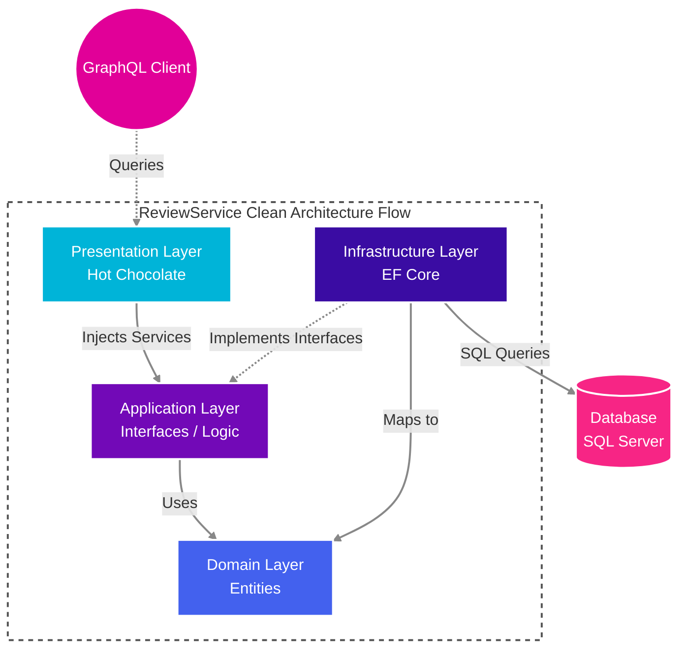

# ⭐ ReviewService.Api

> A modern, high-performance read-only GraphQL API microservice for Product Review data.

This project is part of the Bookswagon Core Architecture, designed to deliver fast, scalable, and efficient product review data using state-of-the-art .NET technologies.

---

## 🏗️ Architecture & Layers

Built solidly on **Clean Architecture** principles to ensure strict separation of concerns, the project is organized into concentric layers where dependencies always point inward.



* **Domain Layer**: Plain C# entities (e.g., `ProductReview`) mapping directly to legacy database tables (like `Table_ProductReview`).
* **Application Layer**: Centralizes business rules, DTOs (e.g., `ProductReviewSummary`), and interface definitions (e.g., `IProductReviewRepository`, `IProductReviewService`).
* **Infrastructure Layer**: Technical implementations handling EF Core, `AppDbContext`, and raw SQL queries.
* **Presentation Layer**: The robust GraphQL entry point powered by Hot Chocolate.

### 🛠️ Key Technologies
* **.NET 10** for ultra-fast, high-performance backend execution.
* **Hot Chocolate** as a modern GraphQL server to completely eliminate data over-fetching.
* **Entity Framework (EF) Core** for robust and reliable SQL Server data access.

---

## ⚙️ Patterns & Best Practices

We've adopted modern C# and GraphQL best practices to ensure stability and high maintainability:

* **`[Service]` Attribute Injection**: Used in GraphQL query methods instead of constructor injection to eliminate `ObjectDisposedException` issues caused by GraphQL's singleton-like lifecycle.
* **ServiceResult Pattern**: Utilizes standardized wrappers with simple success/failure factory methods, rather than relying on computationally expensive exceptions for expected business rule violations.
* **Domain Model UI Calculations**: Uses `[NotMapped]` properties on domain entities to perform simple on-the-fly calculations for UI presentation (e.g. turning `DateCreated` into a `PostDate` string like "X Days Ago").
* **C# 12 Primary Constructors**: Adopted exclusively to significantly reduce boilerplate and prevent constructor-related typos.
* **No MediatR**: Excluded to avoid "double-abstraction", since Hot Chocolate natively serves as the efficient mediator for routing requests here.

---

## 🔒 Configuration & Environment

* **File-Scoped Namespaces**: Standardized globally via an `.editorconfig` file to reduce deep indentation and drastically improve code readability.
* **Secure Secrets**: Production connection strings are safely kept in `appsettings.Development.json` (ignored by Git via `**/appsettings.Development.json`), while the tracked `appsettings.json` contains only safe, public placeholders.
* **Git Security**: Maintained with precise Git cache-clearing commands to guarantee that sensitive config files remain completely untracked if they were previously committed.

## 🚀 Getting Started

### Prerequisites
* **.NET 10 SDK**
* **SQL Server** (LocalDB or Docker container)
* **IDE**: Visual Studio 2022, JetBrains Rider, or VS Code.

### Running Locally
1. Ensure your local SQL Server instance is running.
2. Set your specific connection string in `appsettings.Development.json` (or securely in User Secrets).
3. Run the application via your IDE or CLI:
   ```bash
   dotnet run
   ```
4. Open your browser and navigate to `https://localhost:<port>/graphql` to access the built-in **Banana Cake Pop** GraphQL IDE.

---

## 📡 GraphQL Queries

This API exposes highly optimized Hot Chocolate endpoints. Here is an example you can try directly in Banana Cake Pop:

### 1. `productReviewDetail`
Fetches a comprehensive review summary along with a detailed list of all active reviews for a specific Product.

```graphql
query {
  productReviewDetail(productId: 44265780) {
    totalRating
    avgRating
    totalCount
    reviews {
      id
      reviewTitle
      rating
      reviewBy
      description
      postDate
    }
  }
}
```

---
*Built with ❤️ for Bookswagon.*
