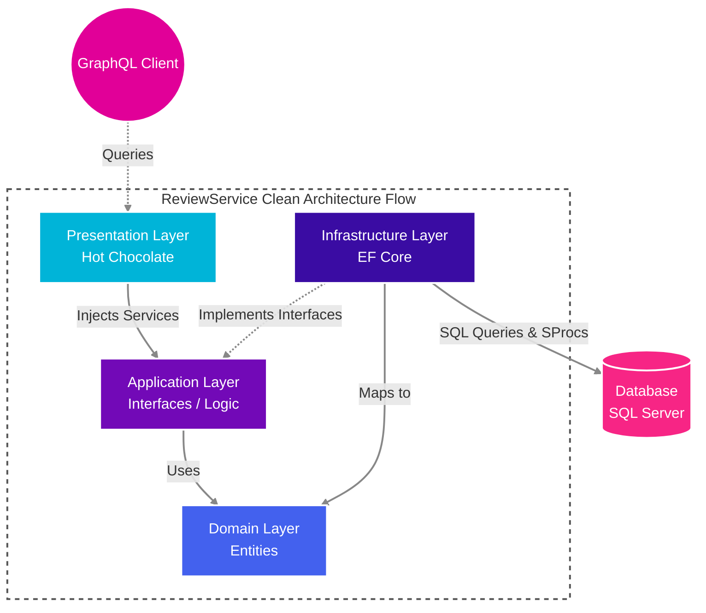
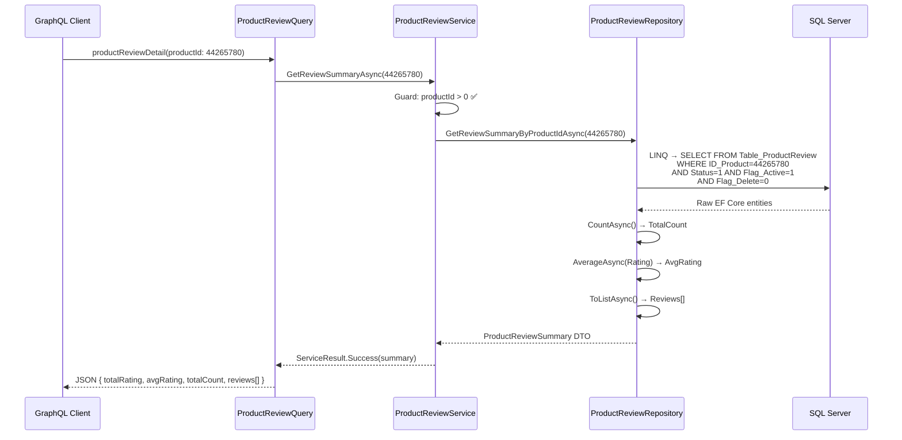
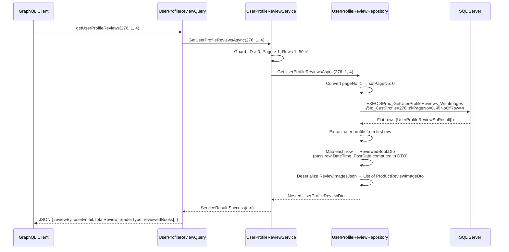
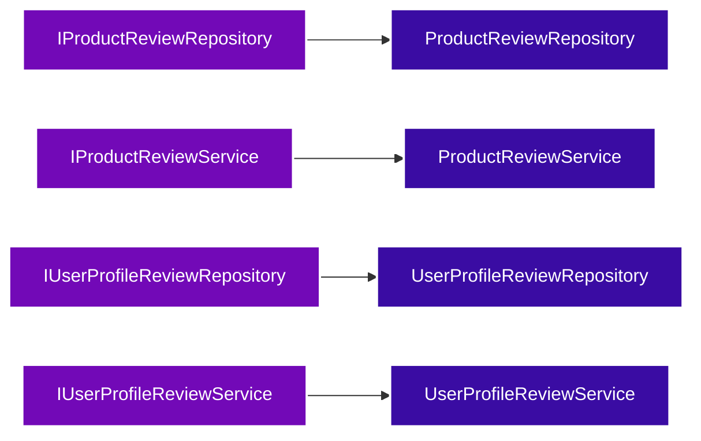

# ⭐ ReviewService.Api

> A modern, high-performance **read-only GraphQL API microservice** for Product Review & User Profile Review data.

This project is part of the **Bookswagon Core Architecture**, designed to deliver fast, scalable, and efficient review data using state-of-the-art .NET technologies. It serves two primary use cases:

1. **Product Review Summaries** — Aggregated ratings and individual reviews for any product page.
2. **User Profile Reviews** — A paginated, nested view of all reviews written by a specific customer (with book details and uploaded images).

---

## 📂 Project Structure

```
ReviewService.Api/
│
├── Program.cs                          ← Application entry point & DI registration
├── ReviewService.Api.csproj            ← Project file (.NET 10, NuGet packages)
├── appsettings.json                    ← Public placeholder config
├── appsettings.Development.json        ← Real connection string (Git-ignored)
│
├── Domain/                             🟦 DOMAIN LAYER (Innermost)
│   └── Entities/
│       └── ProductReview.cs            ← EF Core entity mapped to legacy table
│
├── Application/                        🟪 APPLICATION LAYER
│   ├── Common/
│   │   └── ServiceResult.cs            ← Generic success/failure wrapper
│   ├── Interfaces/
│   │   ├── IProductReviewRepository.cs
│   │   ├── IProductReviewService.cs
│   │   ├── IUserProfileReviewRepository.cs
│   │   └── IUserProfileReviewService.cs
│   ├── Models/
│   │   ├── ProductReviewSummary.cs     ← DTO for product review aggregation
│   │   └── UserProfileReviewDto.cs     ← DTO hierarchy (Parent → Books → Images)
│   └── Services/
│       ├── ProductReviewService.cs     ← Business logic + validation
│       └── UserProfileReviewService.cs ← Business logic + validation
│
├── Infrastructure/                     🟫 INFRASTRUCTURE LAYER
│   ├── Data/
│   │   └── AppDbContext.cs             ← EF Core DbContext (DbSet<ProductReview>)
│   ├── Models/
│   │   └── UserProfileReviewSpResult.cs ← Flat "Loading Dock" class for SP output
│   └── Repositories/
│       ├── ProductReviewRepository.cs   ← LINQ-based EF Core queries
│       └── UserProfileReviewRepository.cs ← Raw SQL stored procedure execution
│
├── GraphQL/                            🟥 PRESENTATION LAYER (Outermost)
│   ├── Queries/
│   │   ├── ProductReviewQuery.cs       ← GraphQL resolver: productReviewDetail
│   │   └── UserProfileReviewQuery.cs   ← GraphQL resolver: getUserProfileReviews
│   └── Types/
│       └── ProductReviewType.cs        ← Hot Chocolate type configuration (reserved)
│
└── Properties/
    └── launchSettings.json             ← Local dev URLs (HTTP: 5110, HTTPS: 7203)
```

---

## 🏗️ Architecture & Layers

Built solidly on **Clean Architecture** principles to ensure strict separation of concerns, the project is organized into concentric layers where dependencies always point inward.



### Layer-by-Layer Breakdown

#### 🟦 Domain Layer — `Domain/Entities/`
The absolute core of the application. Contains **zero dependencies** on any other project layer.

| File | Purpose |
|------|---------|
| `ProductReview.cs` | EF Core entity mapped to the legacy `Table_ProductReview` SQL table via `[Table]` and `[Column]` attributes. Contains a `[NotMapped]` computed property `PostDate` that renders `"X Days Ago"` for UI display. |

**Key Column Mappings:**
| C# Property | DB Column | Notes |
|---|---|---|
| `Id` | `ID_ProductReview` | Primary Key |
| `ProductId` | `ID_Product` | FK to product |
| `RecommendThis` | `RecomendThis` | Nullable bool |
| `ReviewTitle` | `Review_Title` | |
| `ReviewStatus` | `Status` | 1 = Approved |
| `IsActive` | `Flag_Active` | Soft-delete flag |
| `IsDeleted` | `Flag_Delete` | Soft-delete flag |
| `DateCreated` | `Date_Created` | |
| `PostDate` | *(Not Mapped)* | Computed: `"X Days Ago"` |

---

#### 🟪 Application Layer — `Application/`

The business brain. Defines **what** the app does, not **how**.

##### `Common/ServiceResult.cs`
A generic `ServiceResult<T>` wrapper used by every service method. Uses a **private constructor** to force callers through two factory methods:
```csharp
ServiceResult<T>.Success(data)   // ← wraps a successful payload
ServiceResult<T>.Failure("msg")  // ← wraps an error string (no exceptions thrown!)
```

##### `Interfaces/` — Contracts for DI
| Interface | Method Signature | Returns |
|---|---|---|
| `IProductReviewRepository` | `GetReviewSummaryByProductIdAsync(int productId)` | `ProductReviewSummary?` |
| `IProductReviewService` | `GetReviewSummaryAsync(int productId)` | `ServiceResult<ProductReviewSummary>` |
| `IUserProfileReviewRepository` | `GetUserProfileReviewsAsync(int customerProfileId, int pageNo, int noOfRow)` | `UserProfileReviewDto?` |
| `IUserProfileReviewService` | `GetUserProfileReviewsAsync(int customerProfileId, int pageNo, int noOfRow)` | `ServiceResult<UserProfileReviewDto>` |

##### `Models/` — DTOs (Data Transfer Objects)

**`ProductReviewSummary`** — flat aggregation DTO:
| Property | Type | Description |
|---|---|---|
| `TotalRating` | `int` | Hardcoded to `5` (rating scale) |
| `AvgRating` | `double` | Average across all active reviews |
| `TotalCount` | `int` | Total number of reviewers |
| `Reviews` | `List<ProductReview>` | Individual reviews list |

**`UserProfileReviewDto`** — 3-level nested hierarchy:
```
UserProfileReviewDto (Parent: User Profile)
├── ReviewBy, UserEmail, TotalReview, ReaderType
└── ReviewedBooks: List<ReviewedBookDto>
    ├── ISBN13, ProductTitle, ProductTitleUrl, ProductImageLocation
    ├── Rating, ReaderSpoiler, ReviewTitle, Description
    ├── DateCreated (DateTime, [GraphQLIgnore] — hidden from client)
    ├── PostDate (computed: "X Years/Months/Days Ago" or "Today")
    └── ProductReviewImages: List<ProductReviewImageDto>
        ├── ImageCaption
        └── ImageLocation
```

##### `Services/` — Business Logic

**`ProductReviewService`** — Guard clauses:
- ❌ `productId <= 0` → `Failure("Invalid Product ID provided.")`
- ❌ Repository returns `null` → `Failure("Failed to retrieve product reviews.")`
- ✅ Otherwise → `Success(summary)`

**`UserProfileReviewService`** — Guard clauses:
- ❌ `customerProfileId <= 0` → `Failure("Invalid Customer Profile ID.")`
- ❌ `pageNo < 1` → `Failure("Page number must be 1 or greater.")`
- ❌ `noOfRow <= 0 || noOfRow > 50` → `Failure("Number of rows must be between 1 and 50...")`
- ⚪ Repository returns `null` (0 reviews) → `Success(new UserProfileReviewDto())` *(empty state, not an error)*
- ✅ Otherwise → `Success(result)`

---

#### 🟫 Infrastructure Layer — `Infrastructure/`

The technical heavy-lifter. Implements the contracts defined in the Application layer.

##### `Data/AppDbContext.cs`
A minimal EF Core `DbContext` using **primary constructor** syntax:
```csharp
public class AppDbContext(DbContextOptions<AppDbContext> options) : DbContext(options)
{
    public DbSet<ProductReview> ProductReviews { get; set; }
}
```

##### `Models/UserProfileReviewSpResult.cs`
A flat **"Loading Dock"** class designed solely to catch the raw, denormalized output from the `SProc_GetUserProfileReviews_WithImages` stored procedure. Each row contains user profile data (repeated), review data, product data, and a `ReviewImagesJson` column containing a `FOR JSON PATH` subquery output.

##### `Repositories/`

**`ProductReviewRepository`** — Uses pure **LINQ-to-EF Core** queries:
1. Filters reviews by `productId`, `ReviewStatus == 1`, `IsActive`, and `!IsDeleted`.
2. Counts total reviews via `CountAsync()`.
3. Calculates average rating via `AverageAsync()` (only after the count guard to avoid empty-sequence exceptions).
4. Assembles a `ProductReviewSummary` DTO with `Math.Round(avgRating, 1)`.

**`UserProfileReviewRepository`** — Uses **raw SQL stored procedure** execution:
1. Converts UI `pageNo` (1-based) to SQL-compatible (0-based): `var sqlPageNo = pageNo - 1;`
2. Calls `EXEC [dbo].[SProc_GetUserProfileReviews_WithImages]` with `SqlParameter` objects.
3. Maps the flat SP result rows into the nested `UserProfileReviewDto` hierarchy:
   - User profile data extracted from the first row.
   - Each row mapped to a `ReviewedBookDto` — `Date_Created` is passed as raw `DateTime` (the DTO's computed `PostDate` property handles display formatting).
   - `ReviewImagesJson` column deserialized via `System.Text.Json` into `List<ProductReviewImageDto>`.

---

#### 🟥 Presentation Layer — `GraphQL/`

The public-facing API surface, built with **Hot Chocolate**.

Both query classes use `[ExtendObjectType("Query")]` to split the root `Query` type across multiple files.

| Query Class | Schema Name | Description |
|---|---|---|
| `ProductReviewQuery` | `productReviewDetail` | Retrieves aggregated summary + active reviews by Product ID |
| `UserProfileReviewQuery` | `getUserProfileReviews` | Fetches paginated customer reviews with books & images |

Both resolvers follow the same pattern:
1. Call the injected service (via `[Service]` method injection).
2. Check `result.IsSuccess`.
3. On failure → `throw new GraphQLException(...)` (Hot Chocolate formats this into the `"errors"` JSON array).
4. On success → return `result.Data`.

---

## 🛠️ Key Technologies

| Technology | Version | Role |
|---|---|---|
| **.NET** | `10.0` | Runtime & SDK |
| **Hot Chocolate** | `15.1.14` | GraphQL server (`AspNetCore`, `Data`, `Data.EntityFramework`) |
| **Entity Framework Core** | `10.0.6` | ORM & SQL Server data access |
| **SQL Server** | — | Primary database |
| **Banana Cake Pop** | Built-in | GraphQL IDE playground (ships with Hot Chocolate) |

---

## ⚙️ Patterns & Best Practices

| Pattern | Why |
|---|---|
| **`[Service]` Attribute Injection** | Used in GraphQL query resolvers instead of constructor injection to avoid `ObjectDisposedException` issues caused by Hot Chocolate's singleton-like resolver lifecycle. |
| **ServiceResult Pattern** | Standardized success/failure wrappers with factory methods. Avoids computationally expensive exceptions for expected business rule violations. |
| **"Loading Dock" SP Mapping** | A flat `UserProfileReviewSpResult` class catches raw stored procedure output before it's manually assembled into the nested DTO hierarchy. This keeps the domain clean. |
| **DTO-Level Computed Properties** | `[GraphQLIgnore]` hides raw `DateTime` fields from the client, while computed `PostDate` properties on DTOs dynamically format dates into smart "time ago" strings (`"X Years Ago"`, `"X Months Ago"`, `"X Days Ago"`, or `"Today"`) using `DateTime.UtcNow`. |
| **C# 12 Primary Constructors** | Adopted exclusively to reduce boilerplate and prevent constructor-related bugs. |
| **No MediatR** | Excluded to avoid "double-abstraction" — Hot Chocolate natively serves as the mediator for routing requests. |
| **Empty State Handling** | When a user has zero reviews, the service returns `Success(new UserProfileReviewDto())` instead of an error, preventing frontend crashes. |
| **Guard Clause Validation** | Each service method validates inputs (ID > 0, page ≥ 1, rows 1–50) and returns clean failure messages before touching the database. |

---

## 🔗 Data Flow Diagrams

### Flow 1: `productReviewDetail` Query



### Flow 2: `getUserProfileReviews` Query



---

## 🔒 Configuration & Environment

| Setting | Details |
|---|---|
| **File-Scoped Namespaces** | Standardized via `.editorconfig` to reduce indentation |
| **Secure Secrets** | Real connection strings in `appsettings.Development.json` (Git-ignored via `**/appsettings.Development.json`). The tracked `appsettings.json` contains only safe placeholders. |
| **Connection String Key** | `DefaultConnection` (primary) with `ReviewSchemaDB` fallback |
| **Launch URLs** | HTTP: `http://localhost:5110` · HTTPS: `https://localhost:7203` |

---

## 🚀 Getting Started

### Prerequisites
* **.NET 10 SDK**
* **SQL Server** (LocalDB or Docker container)
* **IDE**: Visual Studio 2022, JetBrains Rider, or VS Code.

### Running Locally
1. Ensure your local SQL Server instance is running.
2. Set your specific connection string in `appsettings.Development.json` (or securely in User Secrets).
3. Run the application via your IDE or CLI:
   ```bash
   dotnet run
   ```
4. Open your browser and navigate to `https://localhost:7203/graphql` to access the built-in **Banana Cake Pop** GraphQL IDE.

---

## 📡 GraphQL Queries

This API exposes highly optimized Hot Chocolate endpoints. Here are the queries you can try directly in Banana Cake Pop:

### 1. `productReviewDetail`
Fetches a comprehensive review summary along with a detailed list of all active reviews for a specific Product.

```graphql
query {
  productReviewDetail(productId: 44265780) {
    totalRating
    avgRating
    totalCount
    reviews {
      id
      reviewTitle
      rating
      reviewBy
      description
      postDate
    }
  }
}
```

**Parameters:**
| Param | Type | Description |
|---|---|---|
| `productId` | `Int!` | The unique Product ID to fetch reviews for |

---

### 2. `getUserProfileReviews`
Fetches a paginated list of product reviews written by a specific customer, including associated books and uploaded review images.

```graphql
query{
  getUserProfileReviews(customerProfileId: 276, pageNo: 1, noOfRow: 4) {
    userEmail
    reviewBy
    totalReview
    readerType
    reviewedBooks {
      isbn13
      productTitle
      productTitleUrl
      productImageLocation
      rating
      postDate
      readerSpoiler
      reviewTitle
      description
      productReviewImages {
        imageCaption
        imageLocation
      }
    }
  }
}
```

**Parameters:**
| Param | Type | Constraints | Description |
|---|---|---|---|
| `customerProfileId` | `Int!` | Must be > 0 | The unique ID of the customer profile |
| `pageNo` | `Int!` | Must be ≥ 1 | The page number for pagination |
| `noOfRow` | `Int!` | 1–50 | Number of review rows per page |

**Response Structure:**
| Field | Type | Description |
|---|---|---|
| `userEmail` | `String` | Customer's email address |
| `reviewBy` | `String` | Display name of the reviewer |
| `totalReview` | `Int` | Total number of reviews by this user |
| `readerType` | `String` | Reader classification |
| `reviewedBooks` | `[ReviewedBookDto]` | Array of reviewed books |
| ↳ `isbn13` | `String` | Book ISBN-13 |
| ↳ `productTitle` | `String` | Book title |
| ↳ `productTitleUrl` | `String` | URL-friendly title slug |
| ↳ `productImageLocation` | `String` | Book cover image URL |
| ↳ `rating` | `Int` | Rating given (1–5) |
| ↳ `dateCreated` | — | `[GraphQLIgnore]` — hidden from client, used internally |
| ↳ `postDate` | `String` | Computed "time ago" string (e.g., `"2 Years Ago"`, `"3 Months Ago"`, `"5 Days Ago"`, `"Today"`) |
| ↳ `readerSpoiler` | `String` | Spoiler flag/content |
| ↳ `reviewTitle` | `String` | Title of the review |
| ↳ `description` | `String` | Full review body text |
| ↳ `productReviewImages` | `[ProductReviewImageDto]` | Uploaded review images |
| &nbsp;&nbsp;↳ `imageCaption` | `String` | Caption for the image |
| &nbsp;&nbsp;↳ `imageLocation` | `String` | Image file URL |

---

## 🧩 Dependency Injection Map

All services are registered as **Scoped** in `Program.cs` to align with EF Core's per-request `DbContext` lifecycle:



```csharp
// Infrastructure Layer
builder.Services.AddScoped<IProductReviewRepository, ProductReviewRepository>();
builder.Services.AddScoped<IUserProfileReviewRepository, UserProfileReviewRepository>();

// Application Layer
builder.Services.AddScoped<IProductReviewService, ProductReviewService>();
builder.Services.AddScoped<IUserProfileReviewService, UserProfileReviewService>();
```

---

## 📊 Database Dependencies

| Feature | Data Access Strategy | DB Object |
|---|---|---|
| Product Reviews | **EF Core LINQ** (`DbSet<ProductReview>`) | `Table_ProductReview` |
| User Profile Reviews | **Raw SQL** (`SqlQueryRaw`) | `SProc_GetUserProfileReviews_WithImages` |

The stored procedure `SProc_GetUserProfileReviews_WithImages` returns a flat result set with a `ReviewImagesJson` column containing a `FOR JSON PATH` subquery — the repository deserializes this into nested `ProductReviewImageDto` objects using `System.Text.Json`.

---

*Built with ❤️ for Bookswagon.*
