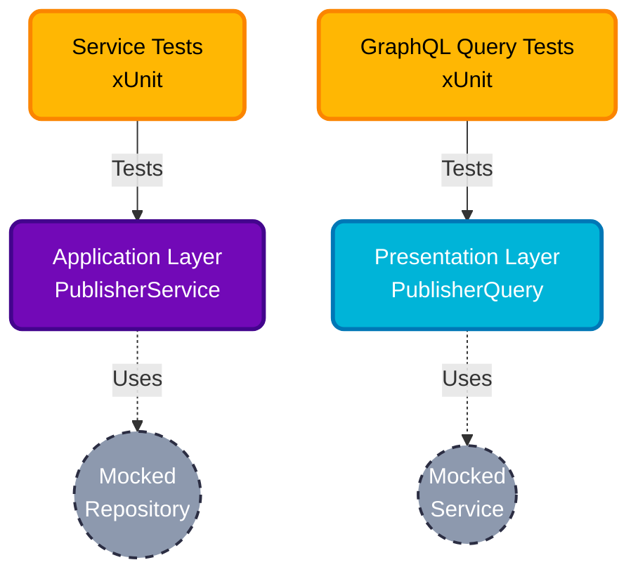

# 🧪 PublisherService.Tests

> Comprehensive Unit Testing suite for the PublisherService API.

This project ensures the reliability and correctness of the business logic and GraphQL presentation layers for the Publisher domain within the Bookswagon Core Architecture.

---

## 🏗️ Testing Architecture & Layers

We follow a strict, layered testing approach aligned with our Clean Architecture, utilizing **xUnit**, **Moq**, and **FluentAssertions**.



**Application Layer Tests (`/Application/Services`)**: Tests the "Chef". Validates business rules, guarantees the `ServiceResult` pattern properly handles missing records, and ensures `IQueryable` sets are correctly passed for searching.

**Presentation Layer Tests (`/GraphQL/Queries`)**: Tests the "Waiter". Ensures Hot Chocolate resolvers correctly unwrap `ServiceResult` objects and handle dynamic filtering seamlessly.

**Infrastructure Layer**: Intentionally excluded from Unit Tests. Repositories are covered by Integration Tests to prevent testing fake in-memory LINQ translations.

## 🛠️ Key Technologies
* **xUnit**: The core testing framework for robust test execution.
* **Moq**: Used strictly for mocking abstractions (e.g., `IPublisherRepository`).
* **FluentAssertions**: Provides highly readable, English-like assertions (e.g., `result.IsSuccess.Should().BeTrue()`).

## ⚙️ Testing Patterns & Best Practices
To maintain high code quality and uniformity, adhere to these established standards when adding new tests:

* **AAA Pattern**: All tests must follow the Arrange, Act, Assert structure for maximum readability.
* **ServiceResult Validation**: Do not test for thrown exceptions in business logic. Always assert against `result.IsSuccess`, `result.IsFailure`, `result.Value`, and `result.ErrorMessage`.
* **IQueryable Mocking**: When testing search functionality (e.g., `SearchPublishers`), mock the repository to return `.AsQueryable()` collections to accurately simulate EF Core behavior for Hot Chocolate projections.
* **GraphQL Exception Handling**: Ensure the Presentation layer tests verify that a failed `ServiceResult` explicitly triggers a `GraphQLException` to maintain standard client error formats.

## 🚀 Getting Started

### Running Tests Locally
You can run the entire test suite via your IDE's Test Explorer, or using the .NET CLI:

```bash
# Run all PublisherService tests
dotnet test Tests/PublisherService.Tests

# Run tests with detailed verbosity
dotnet test Tests/PublisherService.Tests -v n
```

---
*Built with ❤️ for Bookswagon.*
