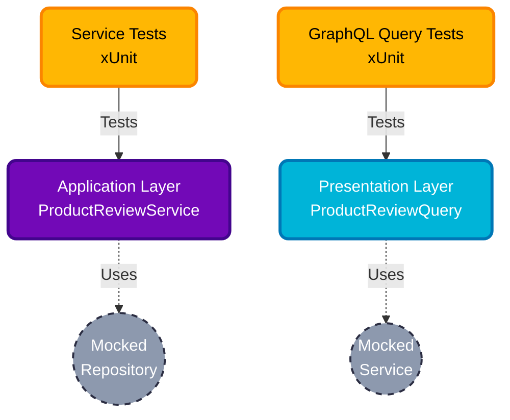

# 🧪 ReviewService.Tests

> Comprehensive Unit Testing suite for the ReviewService API.

This project ensures the reliability and correctness of the business logic and GraphQL presentation layers for the Product Review domain within the Bookswagon Core Architecture.

---

## 🏗️ Testing Architecture & Layers

We follow a strict, layered testing approach aligned with our Clean Architecture, utilizing **xUnit**, **Moq**, and **FluentAssertions**.



**Application Layer Tests (`/Application/Services`)**: Tests the "Chef". Validates business rules, ensures the `ServiceResult` pattern behaves correctly (Success/Failure states), and verifies proper repository interactions without hitting a real database.

**Presentation Layer Tests (`/GraphQL/Queries`)**: Tests the "Waiter". Ensures Hot Chocolate resolvers correctly interpret `ServiceResult` objects, returning accurate GraphQL payloads or standardized `GraphQLException` errors.

**Infrastructure Layer**: Intentionally excluded from Unit Tests. Repositories are covered by Integration Tests to prevent testing fake in-memory LINQ translations.

## 🛠️ Key Technologies
* **xUnit**: The core testing framework for robust test execution.
* **Moq**: Used strictly for mocking abstractions (e.g., `IProductReviewRepository`).
* **FluentAssertions**: Provides highly readable, English-like assertions (e.g., `result.IsSuccess.Should().BeTrue()`).

## ⚙️ Testing Patterns & Best Practices
To maintain high code quality and uniformity, adhere to these established standards when adding new tests:

* **AAA Pattern**: All tests must follow the Arrange, Act, Assert structure for maximum readability.
* **ServiceResult Validation**: Do not test for thrown exceptions in business logic. Always assert against `result.IsSuccess`, `result.IsFailure`, `result.Value`, and `result.ErrorMessage`.
* **Explicit Mocking Verifications**: Use `_mockRepository.Verify(x => ..., Times.Once)` or `Times.Never` to ensure exact execution paths are followed, especially in validation failures.
* **InlineData for Edge Cases**: Utilize `[Theory]` and `[InlineData]` to test multiple variations of invalid inputs (e.g., productId = 0 and -1) without duplicating test logic.

## 🚀 Getting Started

### Running Tests Locally
You can run the entire test suite via your IDE's Test Explorer, or using the .NET CLI:

```bash
# Run all ReviewService tests
dotnet test Tests/ReviewService.Tests

# Run tests with detailed verbosity
dotnet test Tests/ReviewService.Tests -v n
```

---
*Built with ❤️ for Bookswagon*
